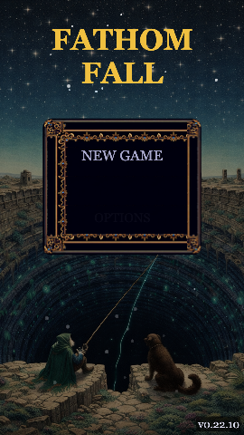
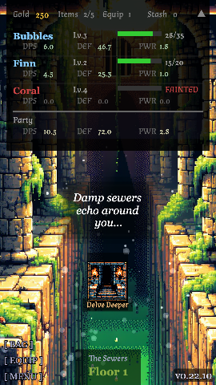
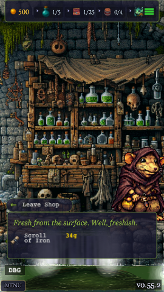

# Fathom Fall

A roguelike dungeon-diving RPG where you lead a party of aquatic creatures through 100 floors of
increasingly perilous depths.

### ▶️ [Play it now at fathomfall.com](https://fathomfall.com) — free, in your browser, no install.

> **The source is private.** This repo documents the game and how it was built. What makes it
> unusual: **every line of game code was written by AI agents** on the
> [FishTank platform](https://github.com/GuppitusMaximus/fish-tank) — my role was game design,
> feature requirements, and plan approval. The game is the platform's largest proof of work.

  
  
  

## The game

Recruit fish, equip gear, and battle down through themed dungeon zones. Combat is auto-battler
style — a party of up to 3 fish fights waves of monsters with speed-based turn order, special
moves, and stackable status effects (poison, burn, curse, heal-over-time).

**Core loop:** delve floors → battle monsters → visit shops → rest at camp → go deeper.

- **7 zones across 100 floors** — Sewers, Goblin Caves, Bone Crypts, Deep Dungeon, Shadow Realm,
  Ancient Chambers, and the Dungeon Heart — each with unique background art, ambient particle
  effects, a themed merchant, and its own UI palette
- **10 fish species** with distinct roles, growth curves, and special moves — from the
  Glimmergupp skirmisher to the tanky Spinebloat to the rare Golden Koi
- **Tetris-style equipment** — gear pieces are shapes placed on a 5×5 grid; symmetric placement
  earns harmony bonuses
- **Asynchronous PvP** — battle ghost snapshots of other players' parties, with server-side
  matchmaking and a leaderboard
- **Anti-stall design** — "Fathom Pressure" stacks a curse on drawn-out fights, so battles resolve

## How it's built

| | |
|---|---|
| Engine | Phaser 3 + Vite, vanilla JavaScript |
| Scale | 12 scenes, 20+ system modules, 100 floors of data-driven content |
| Backend | PvP ghost snapshots, matchmaking with floor-wide fallback, leaderboards |
| QA | Playwright browser tests + a headless battle simulator for combat balance tuning |
| Art | AI-generated pixel art — sprite sheets, zone backgrounds, and portraits produced by a scripted generation pipeline with atlas packing |
| Delivery | Continuous — every change planned, implemented, QA'd, and reviewed by autonomous agents; `main` auto-deploys to fathomfall.com |

The balance work is its own story: a **headless simulator** runs thousands of battles per tuning
pass, so combat math (fish stats, equipment scaling, encounter difficulty) is adjusted against
simulation data rather than gut feel — by an agent whose only job is game balance.

## Version history

The game ships in small, continuous increments — a patch-notes agent auto-generates the changelog
on every version bump, and the version counter passed **v0.69** through hundreds of such releases,
each shipped through the same plan → implement → QA → review pipeline.
