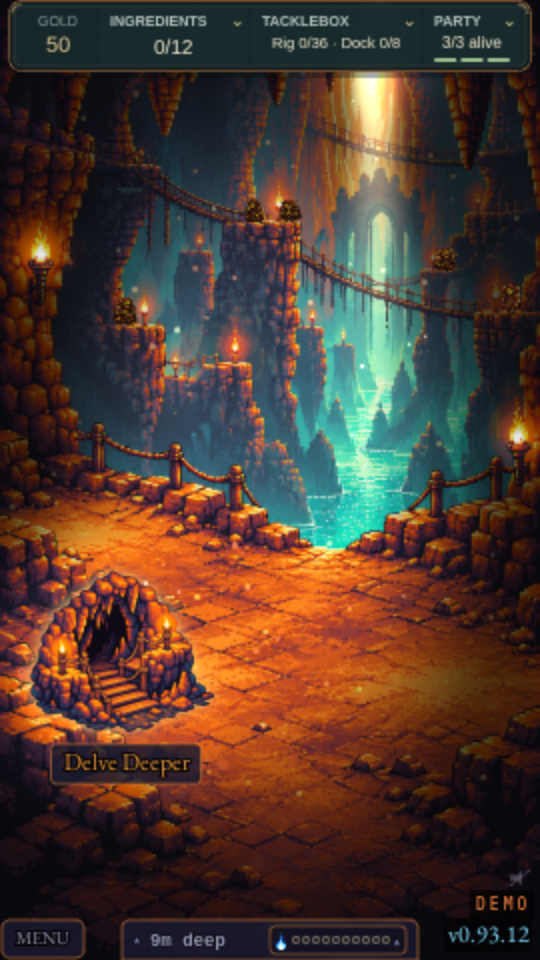
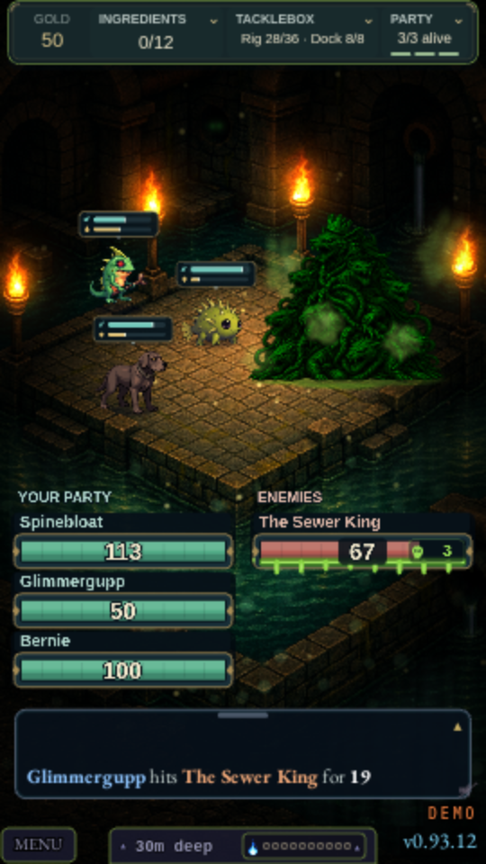
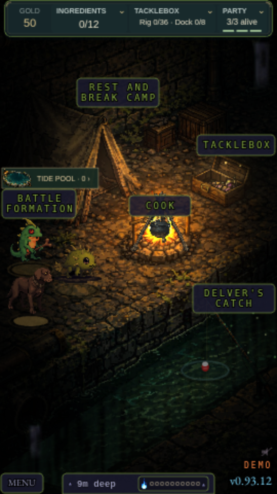
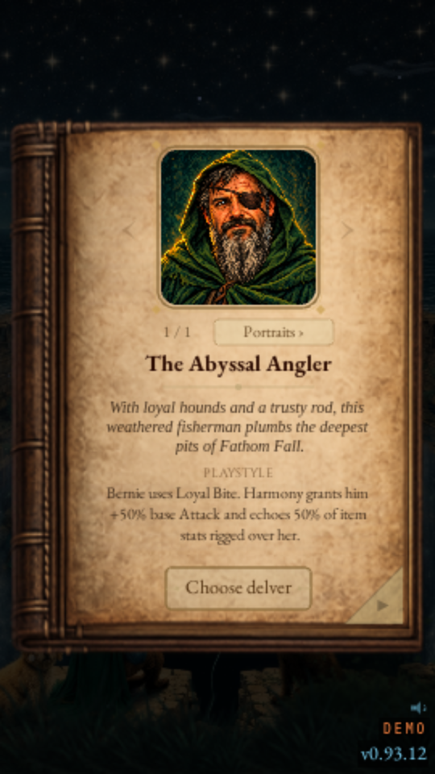
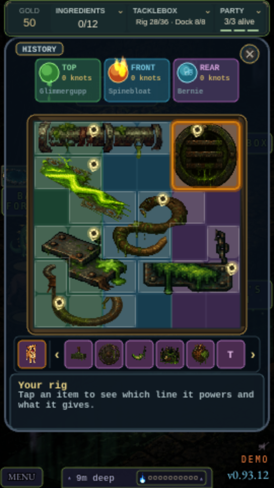
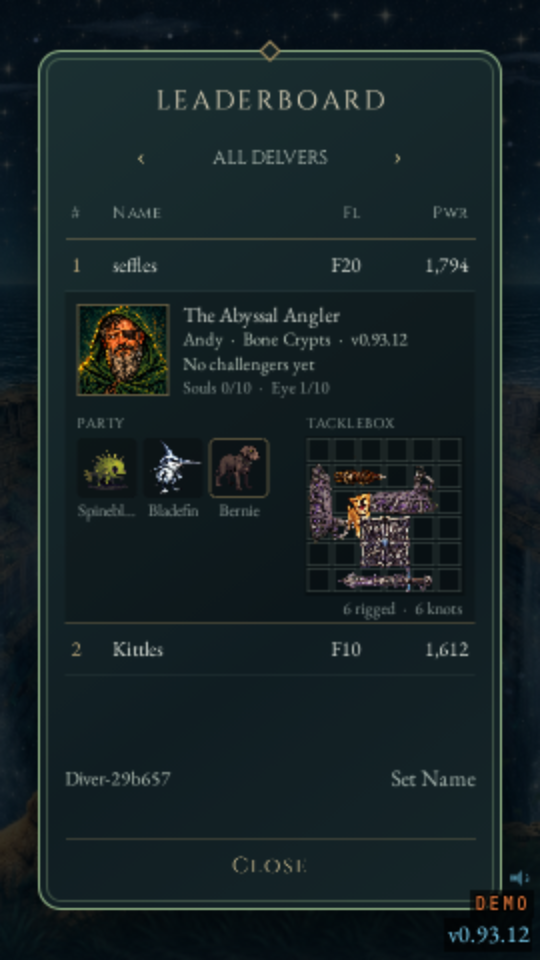
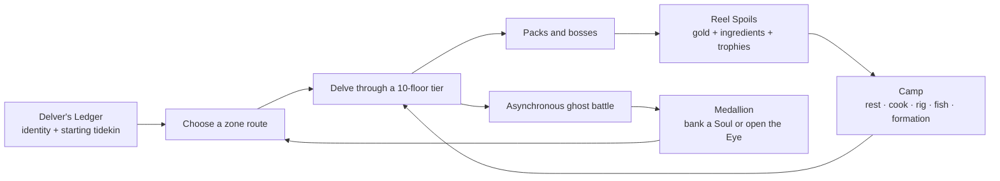

# Fathom Fall

**Build a tidekin party, rig a tacklebox, and carry one run through a branching descent.**

Fathom Fall is a portrait-first browser roguelike built with Phaser. A complete run spans 50 floors
across five 10-floor zones: choose a path among eight normal zone themes, then descend into the
Dungeon Heart. Battles play automatically, but party order, meals, equipment placement, permanent
knots, and the route through the dungeon all shape the result.

### ▶️ [Play the public demo at fathomfall.com](https://fathomfall.com)

The demo is free, runs in the browser, and needs no install. It currently includes the first two
tiers — 20 floors — before ending at a **Coming Soon** screen. The current public build is
**v0.93.12** (September 27, 2026).

> The game source is private. This public repository is a player-facing showcase of the game and
> its development. Fathom Fall is built through the
> [FishTank](https://github.com/GuppitusMaximus/fish-tank) agent workflow: human direction and
> approval, with implementation, QA, balance work, and release support carried out by coding
> agents.

## Current demo gallery

Current UI and gameplay previews, captured from the public v0.93.12 build on September 27, 2026.
Also see the [current title screen](docs/media/title-0.93.12.png).

<table align="center">
  <tr>
    <td align="center"></td>
    <td align="center"></td>
    <td align="center"></td>
  </tr>
  <tr>
    <td align="center"><b>The Fry Pits</b> — choose the next descent</td>
    <td align="center"><b>The Sewer King</b> — the party in battle</td>
    <td align="center"><b>Camp</b> — cook, fish, and prepare</td>
  </tr>
  <tr>
    <td align="center"></td>
    <td align="center"></td>
    <td align="center"></td>
  </tr>
  <tr>
    <td align="center"><b>The Delver's Ledger</b> — choose your delver</td>
    <td align="center"><b>Tackle Weave</b> — build around shape and position</td>
    <td align="center"><b>A recorded rival</b> — inspect the build behind a ghost</td>
  </tr>
</table>

## What a run looks like

The full run draws from nine themed zones: **The Sewers, The Fry Pits, Bone Crypts, The
Underdeep, The Pale Delta, The Gilded Vaults, Molten Forge, Frozen Abyss,** and the final
**Dungeon Heart**. Each route has its own battle, camp, shop, floor, and fall art; monster and boss
rosters; merchant; ambient sound; lighting; and environmental effects.

### Build a party

The book-like **Delver's Ledger** introduces the delver, cosmetic portrait identity, starter
tidekin, and the name carried into PvP. The current playable delver is the Abyssal Angler, who
enters with two chosen tidekin and companion Bernie. At camp, the illustrated Tide Pool lets the
player swap the active three-member formation with recruited tidekin.

Combat runs continuously, with speed-based turns and independent animation lanes for each unit.
Formation, active abilities, critical hits, shields, healing, and the six elemental stats — Pyre,
Frost, Blight, Tide, Hex, and Shell — decide how a party handles each encounter. Fathom Pressure
keeps long fights from stalling.

### Rig the tacklebox

Every equipment trophy is a shaped piece on a **6×6 tacklebox**. Rotate and place its hook over
the front, middle, or back formation line to
choose who receives its effects. Piece stats scale with both zone and the depth at which that copy
was found, so two copies of the same trophy can have different value.

Connected pieces can be **tied off** into permanent knots. The pieces leave the active board, a
reduced part of their power becomes a lasting imprint on that formation line, and their source
remains in the run's knot history. This turns limited board space into the central build decision:
keep a strong shape active now, or convert a connected set into room and permanent power.

Harmony, the Angler's companion, also lives on the board. She grants Bernie 50% of his base Attack
and echoes half the stats of equipment rigged over her, making her position part of the puzzle.

### Recover and prepare at camp

Camp is the planning half of a run:

- **Cook** ingredients into Stew, Broth, Kebab, or Soup, choosing duration and elemental flavour
  for the stretch ahead.
- **Fish in Delver's Catch**, a one-thumb casting and reeling game with timing, line tension, and
  Caught/Great/Perfect grades.
- Use a **Wild Cast** for a seeded mix of equipment, ingredients, gold, or recruits, or sacrifice
  an unequipped trophy in a **Countercurrent Offering** to bias the catch toward a complementary
  stat or element.
- Open the **Tide Pool** to inspect recruits and change formation, or return to the tacklebox to
  rig new trophies and tie off connected pieces.

Fishing attempts are committed when cast and survive a reload, so a result cannot be rerolled by
refreshing the page. Defeats deepen the Undertow and push later catches toward recovery rewards.

### Fight versioned player ghosts

Every zone ends with asynchronous PvP. The opponent is a frozen record of another run rather than
a live player session. The current v2 ghost format captures the party order, resolved combat
specs, tacklebox and knot history, meal, zone path, medallion state, delver identity, and the exact
ruleset/build provenance needed to replay that opponent faithfully.

Those records are immutable and versioned. The game accepts a ghost only when its schema and
ruleset are compatible with the running release; it does not silently rebuild an old opponent
under new balance rules. The leaderboard is therefore a list of actual ghost records. Open a row
to inspect the run behind it, then tap a party member or equipment piece for its card.

A PvP win banks a **Delver's Soul**. A loss opens the **Dungeon Heart's eye** another step and
costs part of the run's gold. The medallion in the bottom bar keeps both histories visible.

## What changed since the earlier showcase

The original showcase described v0.72–0.73. Since then, the interface and several systems have
changed substantially:

- the old linear 100-floor structure became a branching five-tier, **50-floor run**;
- the world expanded and was renamed into **nine zone themes**, with a route choice at each
  non-final tier;
- the old 5×5 equipment grid became the **6×6 Tackle Weave**, with formation-line hooks,
  connected-item tie-offs, permanent knots, and per-copy depth scaling;
- combat moved to the v2 ruleset with six elements, resistances, status buildup, crits, and
  independent animation lanes;
- camp gained cooking, the Tide Pool roster, and **Delver's Catch**, including Countercurrent
  Offerings;
- PvP outcomes now feed the Souls-and-Eye medallion, while PvP v2 preserves immutable,
  release-versioned opponents and inspectable leaderboard records;
- zone art, ambient audio, action destinations, the title scene, battle presentation, and
  on-demand zone loading were extensively rebuilt.

## How it is built

| Area | Current implementation |
|---|---|
| Game | Phaser 3.90, Vite 6, vanilla JavaScript modules |
| Layout | Responsive portrait and landscape canvas; touch-first controls |
| Content | Nine data-driven zone themes with zone-specific equipment, encounters, and art |
| Saves | Browser local storage with explicit format migrations, validation, and battle-resume locks |
| PvP | Versioned ghost records, ruleset compatibility checks, asynchronous matchmaking, and inspectable leaderboards |
| Balance | Deterministic headless simulation across zone orders, parties, equipment policies, meals, and seeds |
| QA | Node-based system tests plus Playwright browser coverage for scenes, saves, responsive layout, and end-to-end flows |
| Art and audio | Pixel-art asset pipelines, atlases and manifests, per-zone lazy loading, layered effects, music, ambience, and UI sound |

Balance changes are measured before release. The simulator can replay the same route, seed, party,
equipment policy, and cooking policy across thousands of battles, so changes to encounter targets,
item scaling, critical hits, or elemental rules can be compared against a stable baseline.

The browser build also loads zone-specific art on demand. That keeps the growing set of animated
backgrounds, monsters, merchants, effects, and audio practical on mobile browsers.

## Availability and project status

| Capability | Status |
|---|---|
| Browser demo | Available now at [fathomfall.com](https://fathomfall.com); first two tiers / 20 floors |
| Current game structure | Five tiers / 50 floors, choosing four routes before the Dungeon Heart |
| Native iOS and Android apps | Planned; no native build is currently published |
| Account login and cross-device progression | Planned; the current demo uses local browser saves |
| Payments | Planned for a later release; none are enabled in the current demo |

Fathom Fall is under active development. This page describes the v0.93.12 release and will change
as development continues.
