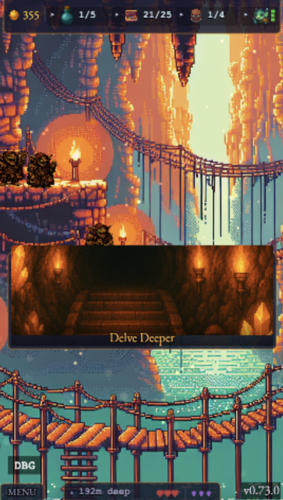
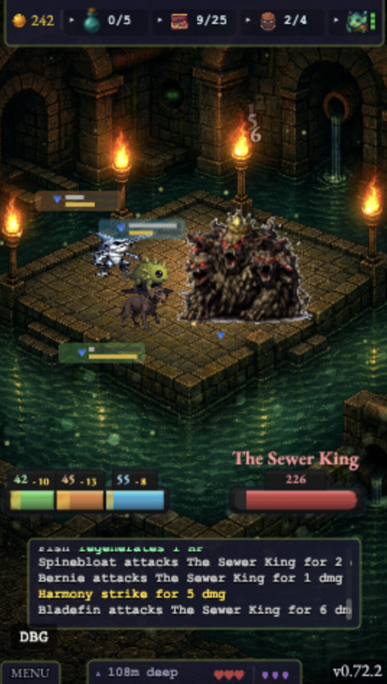
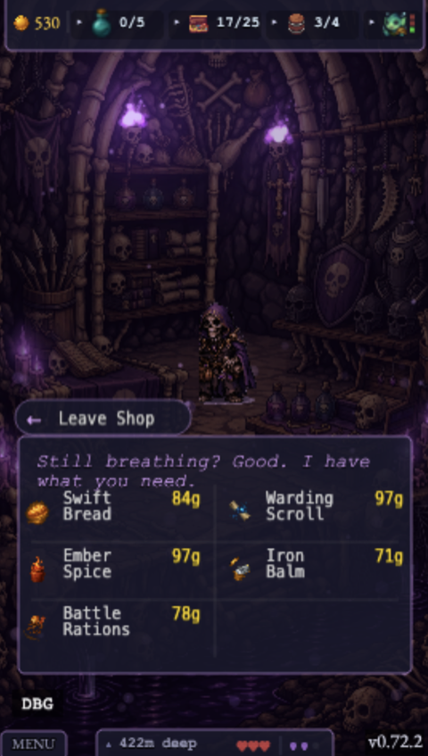
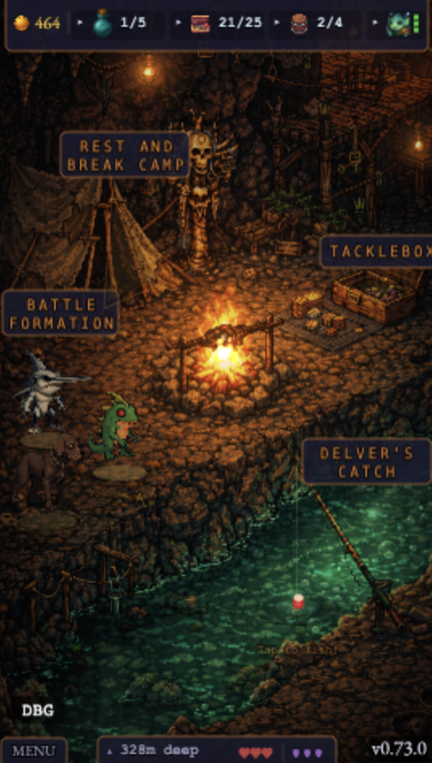
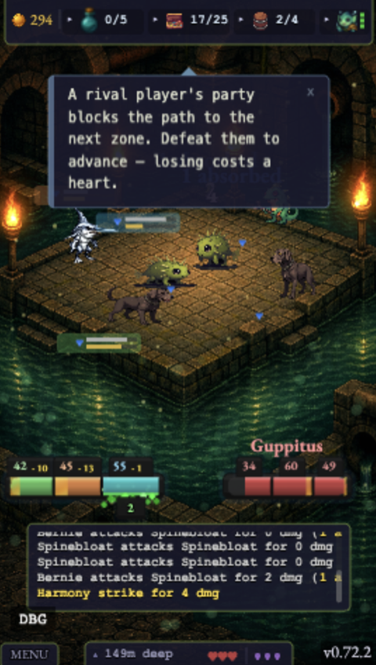
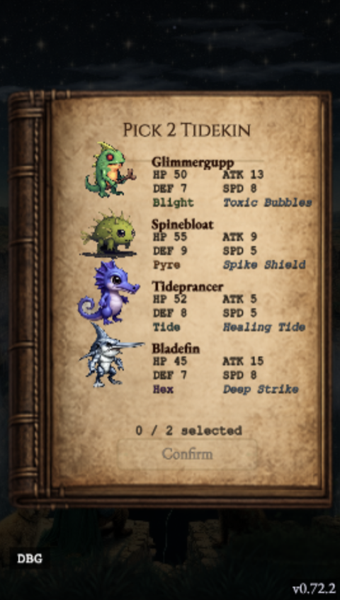
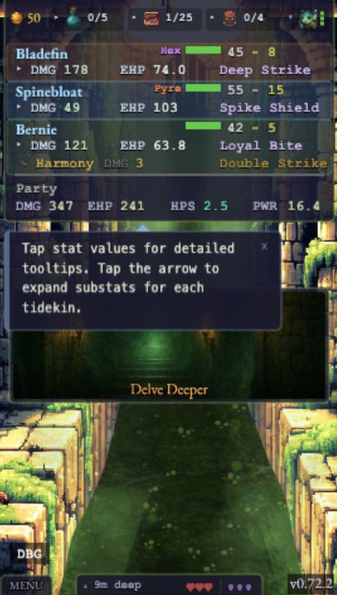
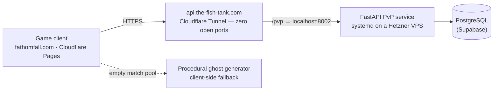

# Fathom Fall

A roguelike dungeon-diving RPG where you lead a party of aquatic creatures through 100 floors of
increasingly perilous depths.

### ▶️ [Play it now at fathomfall.com](https://fathomfall.com) — free, in your browser, no install.

> **The source is private.** This repo documents the game and how it was built. What makes it
> unusual: **every line of game code was written by AI agents** on the
> [FishTank platform](https://github.com/GuppitusMaximus/fish-tank) — my role was game design,
> feature requirements, and plan approval. The game is the platform's largest proof of work.

<table align="center">
  <tr>
    <td align="center"></td>
    <td align="center"></td>
    <td align="center"></td>
  </tr>
  <tr>
    <td align="center"><b>The Goblin Caves</b> — lantern-lit descent, goblins watching</td>
    <td align="center"><b>Zone boss</b> — The Sewer King, 108m deep</td>
    <td align="center"><b>Themed merchants</b> — the Bone Crypts shopkeeper</td>
  </tr>
  <tr>
    <td align="center"></td>
    <td align="center"></td>
    <td align="center"></td>
  </tr>
  <tr>
    <td align="center"><b>Camp</b> — rest, battle formation, and fishing for recruits</td>
    <td align="center"><b>Async PvP</b> — a rival player's ghost party blocks the path</td>
    <td align="center"><b>The Delver's Ledger</b> — picking a starting party</td>
  </tr>
  <tr>
    <td align="center" colspan="3"></td>
  </tr>
  <tr>
    <td align="center" colspan="3"><b>The stat layer</b> — per-fish substats, party-wide aggregates, and equipment harmony bonuses</td>
  </tr>
</table>

## The game

Recruit fish, equip gear, and battle down through themed dungeon zones. Combat is auto-battler
style — a party of up to 3 fish fights waves of monsters with speed-based turn order, special
moves, and stackable status effects (poison, burn, curse, heal-over-time).

**Core loop:** delve floors → battle monsters → visit shops → rest at camp → go deeper.

- **7 zones across 100 floors** — Sewers, Goblin Caves, Bone Crypts, Deep Dungeon, Shadow Realm,
  Ancient Chambers, and the Dungeon Heart — each with unique background art, ambient particle
  effects, a themed merchant, and its own UI palette
- **10 fish species** with distinct roles, growth curves, and special moves — from the
  Glimmergupp skirmisher to the tanky Spinebloat to the rare Golden Koi
- **Tetris-style equipment** — gear pieces are shapes placed on a 5×5 grid; symmetric placement
  earns harmony bonuses
- **Asynchronous PvP** — battle ghost snapshots of other players' parties, with server-side
  matchmaking and a leaderboard
- **Stat depth under a simple surface** — per-fish damage and effective-HP with expandable
  substats, party-wide aggregates (healing per second, a single power score), status affinities,
  and equipment harmony bonuses all feed the combat math
- **Anti-stall design** — "Fathom Pressure" stacks a curse on drawn-out fights, so battles resolve

## How it's built

| | |
|---|---|
| Engine | Phaser 3 + Vite, vanilla JavaScript |
| Scale | 12 scenes, 20+ system modules, 100 floors of data-driven content |
| Backend | FastAPI PvP service + PostgreSQL on a VPS behind a Cloudflare Tunnel — see [The PvP backend](#the-pvp-backend) |
| QA | Playwright browser tests + a headless battle simulator for combat balance tuning |
| Art | AI-generated pixel art — sprite sheets, zone backgrounds, and portraits produced by a scripted generation pipeline with atlas packing |
| Delivery | Continuous — every change planned, implemented, QA'd, and reviewed by autonomous agents; `main` auto-deploys to fathomfall.com |

The balance work is its own story: a **headless simulator** runs thousands of battles per tuning
pass, so combat math (fish stats, equipment scaling, encounter difficulty) is adjusted against
simulation data rather than gut feel — by an agent whose only job is game balance.

## The PvP backend

The asynchronous PvP runs on a real service with its own infrastructure:

- **Snapshots, not live sessions.** After a PvP battle, the client uploads a snapshot of the
  player's real party — fish, levels, equipment grid, companion, display name. Uploads are
  schema-validated server-side (Pydantic: species and character whitelists, ID and name rules),
  so the pool can't be poisoned with malformed parties.
- **Matchmaking that degrades gracefully.** Opponents are matched by floor and power level: a
  ±15% power bracket first, widening to ±30%, then any same-floor snapshot — and if the pool is
  truly empty, the client generates a procedural ghost party locally so a battle always happens.
  New players never hit a dead end; real player snapshots take over as the pool fills.
- **A deepest-floor leaderboard** with player-chosen delver names, validated like everything else.
- **Run like production, sized like a hobby.** Structured JSON logging, a health endpoint,
  database migrations, systemd with auto-restart — and push-to-deploy: a merge that touches the
  backend triggers GitHub Actions to SSH into the VPS, install, migrate, and restart the service.
  The tunnel means the VPS exposes no inbound ports at all.

## Version history

The game ships in small, continuous increments — a patch-notes agent auto-generates the changelog
on every version bump, and the version counter passed **v0.73** through hundreds of such releases,
each shipped through the same plan → implement → QA → review pipeline.
